# UnityWireframeRenderer
Get a beautiful cross-platform wireframe renderer for your meshes in just one click


## Features
+ Supports `MeshRenderer` and `SkinnedMeshRenderer`
+ Customize line color and size
+ Option to show back faces (culling on/off)
+ Shaded mode
+ Doesn't require geometry shader, works on Android/iOS/Webgl 
+ Add the `WireframeRenderer` component in Editor mode for zero runtime setup costs

## Instructions
+ Import the `packages/UnityWireframeRenderer.package`
+ Add the `WireFrameRenderer` component to any Game Object with a (Skinned)MeshRenderer inside it.

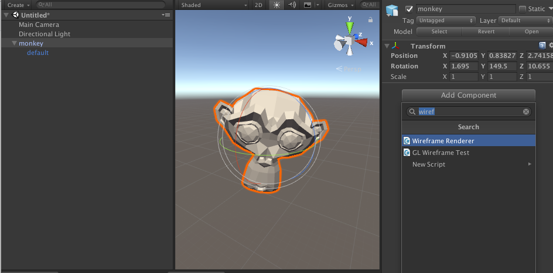


## Couldn't we just use a geometry shader?

Yes, and that is the best solution both int performance and memory usage, but according to the [documentation](https://docs.unity3d.com/Manual/SL-ShaderCompileTargets.html), geometry shaders require the target shader model 4.0, which is not supported in some platforms:

### pragma target 4.0
+ DX11 shader model 4.0.
+ Not supported on DX9, DX11 9.x (WinPhone), OpenGL ES 2.0/3.0/3.1, Metal.
+ Supported on DX11+, OpenGL 3.2+, OpenGL ES 3.1+AEP, Vulkan, PS4/XB1 consoles.
+ Has geometry shaders and everything that es3.0 target has.

## Implementation

Every mesh is made out of triangles. This is what a triangle looks like:

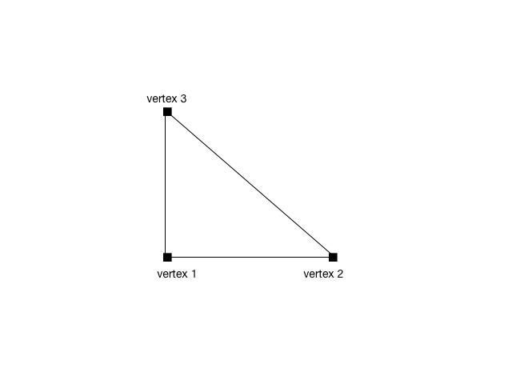

The objective of a wireframe is show the underlying shape (edges) of a mesh, so we need a fragment shader that only "paints" a fragment if it is near one of the edges. We can use the vertices uv to create a space that makes it easier to calculate these distances.

 

For every fragment, we will have access to the interpolated value of the uv coordinates defined for each of the vertices

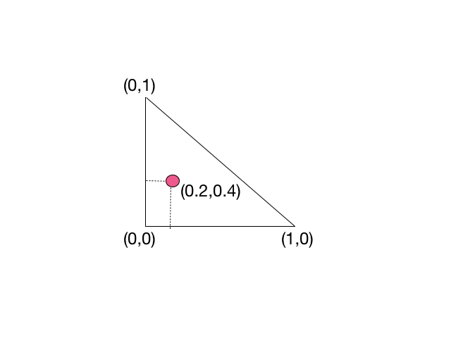

Knowing this, it's easy to get the distances to all of the edges

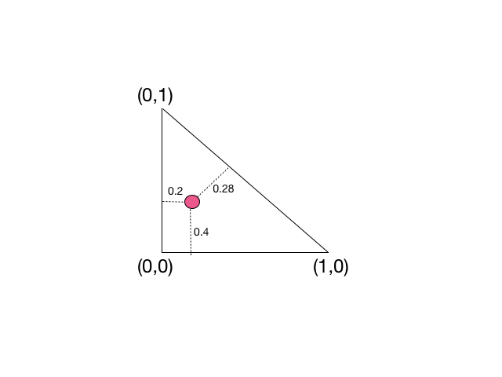

With these distances, the fragment shader just needs to decide whether or not to "fill" the actual fragment. If the minimum edge distance is greater than some threshold, the resulting color is fully opaque, otherwise it is fully transparent.

If we set the threshold to 0.1, then the previous point would be considered to be too far away from any edge to be filled in.

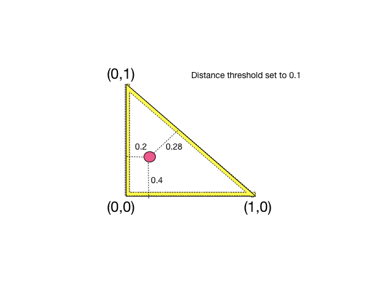

Here is a little gif showing different thresholds in action:

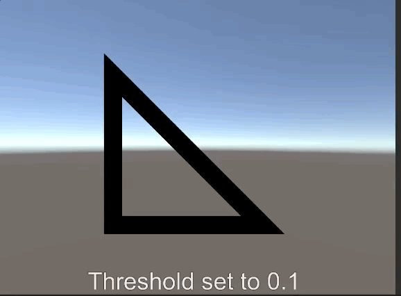

This works nicely but it has one big drawback. Since we are working in UV space, the same threshold will result in different line sizes depending on the triangle screen-space size.

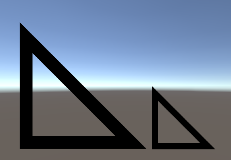

The image above depicts a case where two triangles have the same threshold but the one in the right has a line with half the size.

To fix this, we need to think in pixel space, and convert it back to uv space.

To achieve that, we need to resort to shader derivatives. These derivatives tell us the rate of change for a given value between two neighbouring fragments.


The following image shows the derivative for the u value in the x direction

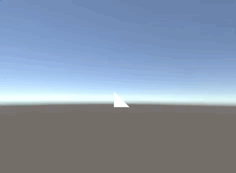

A color closer to white means an higher rate of change, while a darker color represents the opposite. As you can see, the derivative is the same for all fragments covering the triangle. As the triangle gets bigger (occupies more screen space), the u value changes ever more slowly between each individual fragment.

If we change the scale in the y axis only, notice how the u derivative remains the same

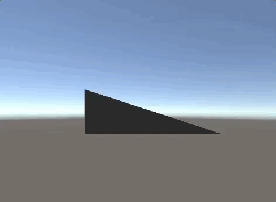

This happens because we are only changing the scale in the y component, and thus the rate of change for the u values remains the same in the x direction.


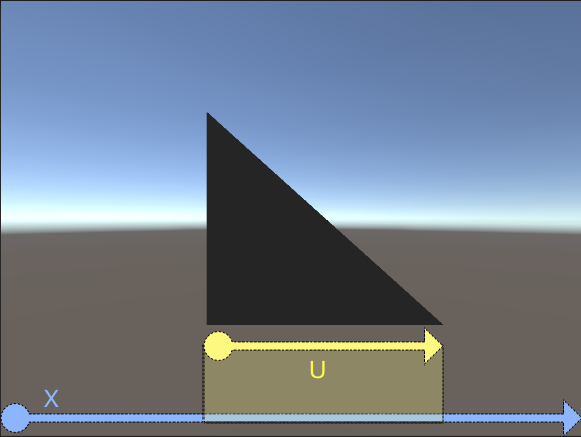

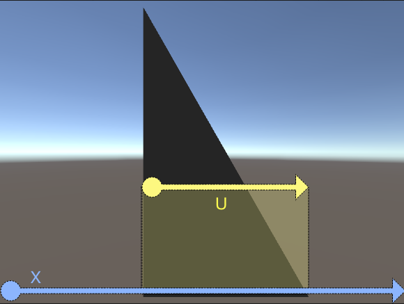

Using the u derivative in the screen x direction alone is not enough, and we can see its limitations once we start rotating the triangle, like in this example, where we rotate it by 90º:

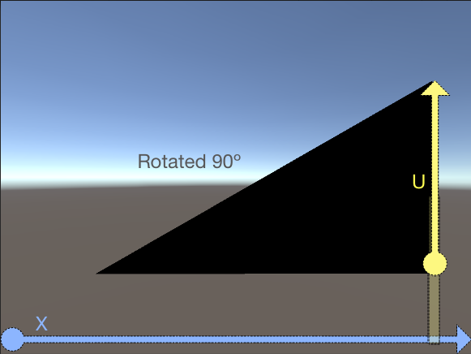

If we only used the x derivative of the u component, it would mean that, in the picture depicted above, we would get a 0 rate of change for the u component, which doesn't help us converting from pixel to uv space.

So instead of just getting the derivative in one of the directions

`float uDerivative = ddx(i.uv.x)`

Let's instead calculate the `u` derivative vector, in both the x and y directions

`float2 uVector = float2(ddx(i.uv.x),ddy(i.uv.x));`

also known as the tangent vector.


By thinking in terms of derivative vectors, instead of scalar values, we get an accurate measure of how the `u` component changes per fragment.

By knowing the rate of change for the `u` component per fragment, we know by extension the maximum distance to the `(0,0) -> (0,1)` edge for a given line size.

```
float lineWidthInPixels = _LineSize;

float2 uVector = float2(ddx(i.uv.x),ddy(i.uv.x)); 

float vLength = length(uVector);

float maximumUDistance = lineWidthInPixels * vLength;

float leftEdgeUDistance = i.uv.x;
float rightEdgeUDistance = (1.0-leftEdgeUDistance);
    
float minimumUDistance = min(leftEdgeUDistance,rightEdgeUDistance);
```

We then calculate the normalized `uDistance` in relation to the `maximumUDistance`

``` 
float normalizedUDistance = minimumUDistance / maximumUDistance;
```

if `normalizedUDistance` is `<= 1.0` it means it is part of the left edge covered by the line with the size we want.

The same concept is applied to the `v` vector and the "diagonal vector".

```
float2 uVector = float2(ddx(i.uv.x),ddy(i.uv.x)); //also known as tangent vector
float2 vVector = float2(ddx(i.uv.y),ddy(i.uv.y)); //also known as binormal vector

float vLength = length(uVector);
float uLength = length(vVector);
float uvDiagonalLength = length(uVector+vVector);
```

and in the end we get the minimum distance to the closest edge

```
float closestNormalizedDistance = min(normalizedUDistance,normalizedVDistance);
closestNormalizedDistance = min(closestNormalizedDistance,normalizedUVDiagonalDistance);
```

And we decide whether or not to fill the pixel by setting is alpha value between 0.0 and 1.0

```
float lineAlpha = 1.0 - step(1.0, closestNormalizedDistance);
```

This works but we end up with a visible aliasing artifact, so we use a smooth transition instead

```
float lineAlpha = 1.0 - smoothstep(1.0,1.0 + (lineAntiaAliasWidthInPixels/lineWidthInPixels),closestNormalizedDistance);
```

The main problem with this approach is that we need to preprocess the mesh to ensure that all of its triangles match the one depicted at the beginning of this section:


This implies that all vertices inside each triangle must have a different uv coordinate. This property can be a pain to guarantee in a mesh with vertices shared between multiple triangles, so, our current solution (of which I'm not very proud of), is just to clone the mesh and recreate the topology to ensure that no vertices are shared between multiple triangles. In some cases, this means that we will have several duplicates of a single vertex.